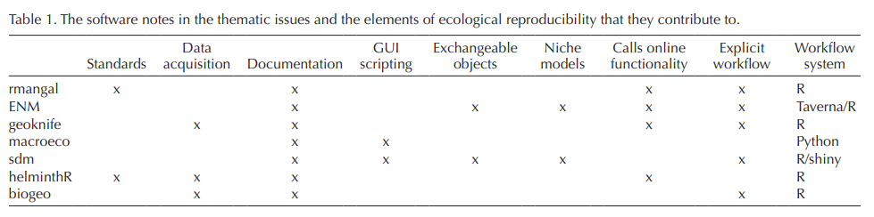

# Introduction

  Depuis la pandémie, la quantité d'articles scientifiques publiée sur des sites de prépublication à énormément augmenté. Cet accès facile à la publication sans délais importants et sans révisions par les paires est intéressant pour les chercheurs qui veulent faire connaître leurs recherches et cherchent la reconnaissance dans leur domaine. Cependant, un article publié dans de tels sites n'est pas révisé et peut contenir plusieurs erreurs qui, normalement, auraient pu être détectées avec la publication par des réviseurs. De plus, le plus grand problème est le faible taux de réplication de ses articles. Normalement, un journal scientifique va effectuer une révision d'un article reçue pour, ainsi, minimiser les erreurs potentielles. Cependant, même après une révision, la reproductibilité des expérimentations scientifiques est quelque chose de difficile à atteindre. La majorité des chercheurs, soit près de 70%, affirment n'ayant pas réussi à reproduire l'expérience d'un autre chercheur (@baker2016reproducibility). Ainsi, la reproductibilité des résultats obtenus dans ses articles peut être difficile.

  Le but de cet essai est de permettre aux chercheurs de comprendre l'importance des principes de standards de reproduction, en mettant de l'avant des stratégies tel que la prise de données, l'utilisation de divers logiciels, ainsi que la transparence.

# Mise en contexte

  Étant donnée la grande augmentation de rapport de recherche mis à la disposition du public sur les sites de prépublication, la reproductibilité est de plus en importante. Elle permet de s'assurer d'un minimum d'erreur dans les données d'une analyse, ainsi que d'assurer la fiabilité des résultats obtenus et que l'analyse est juste. Comme les résultats des articles prépubliés pourraient faire l'objet d'intérêt et pourraient être utilisés par d'autres chercheurs cherchant à pousser plus loin l'analyse ou vérifier les résultats obtenus, il faut émettre le doute que les résultats de ces articles ne sont peut-être pas fiables. Ce sont des articles qui n'ont pas été révisés et si l'on voit les sites de prépublication comme des sites permettant de vérifier la reproductibilité des analyses pour mettre le doigt sur des erreurs possibles, il faudrait alors mettre tout en oeuvre pour que ces articles soient reproductibles. Ainsi ces articles pourraient être peaufinés et pourraient par la suite être considérés pour la création d'autres recherches ou analyses.

# Prise de données

  Pour permettre une meilleure reproductibilité, il y a plusieurs choses à prendre en considération. Tout d'abord, il y la méthode de prise de données. Dans l'article de Barba 2016(@barba2016hard), la rechercheuse en chef explique qu'elle utilise les meilleures pratiques pour la reproductibilité de ses recherches. Dans son laboratoire, ils entreposent les codes utilisés dans un répertoire et à chaque fois qu'un changement est apporté, il est enregistré. Ils prennent également le temps de créer un "reproducibility package" lorsqu'ils publient un article pour y déposer les données et tous les codes nécéssaires pour reproduire les analyses. Dans son article, elle mentionne également que plusieurs chercheurs l'invitent à des rencontres pour qu'elle parle de ses pratiques. Elle est un bon exemple de standards de reproductibilité, mais c'est standard ont un coup. Ils prennent du temps à être appris et demandent de la discipline.

# Logiciels

  L'article de Borreggard et Hart 2016(@borregaard2016towards) quant à lui, cherche à amener des solutions pour augmenter la reproductibilité des recherches scientifiques. Il fait mention de plusieurs outils pouvant aider les chercheurs à avoir des standards plus élevés au niveau de la reproductibilité. Plusieurs de ses outils peuvent apporter une aide précieuse aux chercheurs et surtout ceux dans le domaine de l'écologie. De nos jours, la majorité des données prises dans ce domaine sont par la suite analysées par des logiciels informatiques comme R pour permettre de comprendre et d'interpréter les résultats. Comme l'utilisation de logiciel informatique pour l'analyse de données se fait de plus en plus fréquente, les récentes technologies peuvent maintenant collaborer entre eux pour permettre l'acquisition des données, leur analyse et la création de différents graphiques pour ainsi établir un environnement de travail documenté et standardisé. Dans leur article, Borreggard et Hart ont effectué une liste des différents logiciels souvent utilisés et la façon dont ils peuvent venir aider les chercheurs dans leurs analyses pour leur permettre de voir les différentes erreurs et augmenter la reproductibilité.

# Transparence

  Un autre aspect qui vient jouer un rôle au niveau de la reproductibilité et qui est très important sur plusieurs niveaux dans un article de recherche est la transparence. Un sujet où ce ne sont pas tous les chercheurs qui sont du même avis. Dans le domaine scientifique, la transparence peut être considérée comme étant le partage des données recueillies et des démarches effectuées pour arriver à l'analyse finale. Pour certains, donner accès à leurs données et à leur démarche au public n'est pas quelque chose de souhaitable, car il pourrait y avoir une mauvaise interprétation ou un mauvais jugement au niveau de leur analyse. Cependant, la transparence est ce qui mène à une meilleure réplicabilité (@wang2016transparency). En plus, un manuscrit peut bénéficier d'un plus grande transparence en partageant les données et les démarches. Cela pourrait devenir une base fiable pour d'autres études. Si un chercheur ne veut pas être transparent, cela peut causer des problèmes. Par exemple, s'il manque d'informations, il est impossible d'arriver à répliquer l'analyse. Également, plus la recherche est complexe et plus il est primordial qu'il y ait transparence. Certains tentent de diminuer leur transparence en offrant les démarches ou les étapes de l'analyse sous une autre forme que celles utilisées à la base, comme mentionné dans l'article de Haibe & al. (@haibe2020transparency). Cependant, lorsque, par exemple, un code est transformé en mode texte, la compréhension des démarches effectuées peut devenir difficile et la réplication, une tâche complexe. Il est donc important pour la science d'avancée vers l'avenir et d'opter vers des solutions qui vont permettre l'avancement en offrant une transparence.

# Conclusion

  Ainsi, les standards de reproductibilité sont importants pour un article scientifique. Ils permettent de confirmer les résultats et les analyses présentes dans l'article en plus d'offrir la chance aux chercheurs une meilleure compréhension. Pour s'assurer d'une bonne reproductibilité, il faut avoir de bonnes pratiques au niveau de la prise de données, de leur entreposage. Il existe plusieurs logiciels et méthodes permettant de rendre ces standards plus facilement atteignable. Également, la transparence, dans une certaine mesure, est la clé pour permettre à d'autres chercheurs de pouvoir répliquer la recherche. Bien que la science évolue constamment, les standards de reproductibilités devraient faire partie de cette évolution et être intégré à la science. Il y a, cependant, plusieurs autres aspects de ses standards qui restent à développer.

\newpage

# Bibliographie {.unnumbered}
